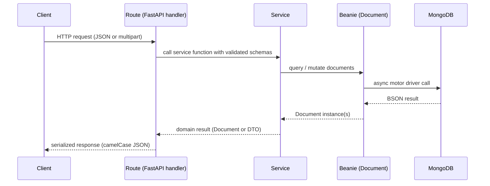

# Architecture

## Single responsibility per layer

The backend is split into four layers — routes, services, db — plus two shared groups (schemas and utils). Every file has one job. Routes parse HTTP and shape responses; they do not touch the database or run business rules. Services own the rules: "an animal must be `available` before an adoption request" or "a refresh token must verify a real user." The db layer is leaf-level Beanie `Document` classes that describe collections and indexes — they hold no logic. Schemas describe the wire format (Pydantic models with camelCase aliases); utils carries cross-cutting helpers (JWT, bcrypt, pagination, exception classes, time). Splitting it this way keeps each file small enough to fit in a head and means a change to one concern — switching to session cookies, swapping bcrypt for argon2, replacing pagination — lands in one place.

## Strict call direction

The allowed import direction is **routes → services → db**. Routes import services only, never Beanie documents. Services import db documents (and other services where it makes sense) but never reach back into a route. db files import nothing from the application layer above them; they are pure persistence. This rule is enforced by convention rather than tooling: every import statement in this repo respects it, and breaking it would create either a cycle or business logic hidden inside an HTTP handler. The smoke tests in `tests/` validate the public behavior through the routes — the same observable surface a real client uses — which gives confidence that the layering hasn't drifted, because broken layering tends to show up as broken endpoints.
